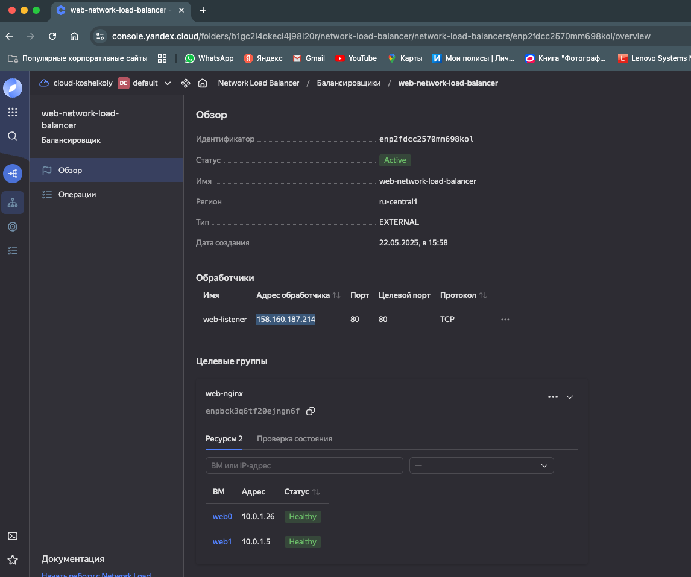
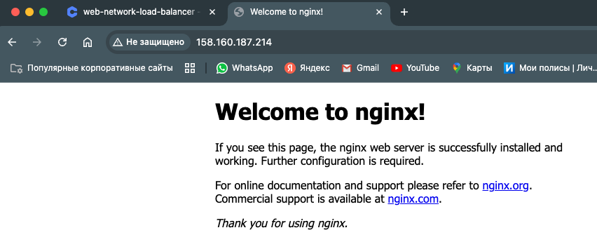

# Домашнее задание к занятию "`Отказоустойчивость в облаке`" - `Кошель Николай Павлович`

### Задание 1
1. Terraform Playbook.
  [network](network.tf)
  [vm](vms.tf)
3. Скриншот статуса балансировщика и целевой группы.

4. Скриншот страницы, которая открылась при запросе IP-адреса балансировщика.

